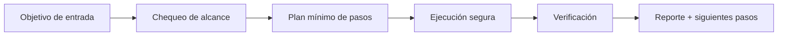

# 🔍 Abyss Scanner

<p align="center">
  
</p>

<p align="center">
  <a href="./README.md"></a>
  <a href="./README.es.md"></a>
</p>

<p align="center"><em>🔍 OSINT stealth/anti-fingerprint.</em></p>

---

## Resumen
Escáner OSINT con navegación stealth, rotación de huellas y estrategias anti-fingerprinting para investigación en superficies complejas manteniendo trazabilidad y límites éticos.

## Arquitectura de entendimiento


## Instalación
```bash
git clone https://github.com/smouj/Abyss-Scanner.git
cd Abyss-Scanner
cat SKILL.es.md
```

## Uso rápido
```bash
printf "ejecutando abyss-scanner...\n"
```

## Estado
- Status: Iniciando
- Dificultad: Muy Alta

## Roadmap
- [ ] Implementar lógica core v0
- [ ] Añadir tests de integración
- [ ] Publicar tag estable v1.0.0
