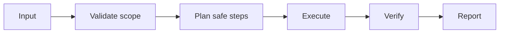

# 🔍 Abyss Scanner

<p align="center">
  
</p>

<p align="center">
  <a href="./README.md"></a>
  <a href="./README.es.md"></a>
</p>

## Overview
Stealth OSINT scanner with anti-fingerprinting and controlled evidence extraction.

## Purpose
Deep research/OSINT stealth: navega superficies complejas con anti-fingerprinting y extracción de intel con trazabilidad.

## Installation
```bash
git clone https://github.com/smouj/Abyss-Scanner.git
cd Abyss-Scanner
cat SKILL.md
```

## Architecture (understanding)


## Status
Initiating

## Difficulty
Muy Alta
