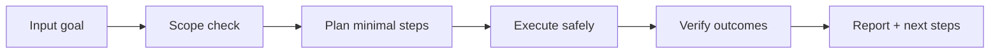

# 🔍 Abyss Scanner

<p align="center">
  
</p>

<p align="center">
  <a href="./README.md"></a>
  <a href="./README.es.md"></a>
</p>

<p align="center"><em>🔍 OSINT stealth/anti-fingerprint.</em></p>

---

## Overview
Escáner OSINT con navegación stealth, rotación de huellas y estrategias anti-fingerprinting para investigación en superficies complejas manteniendo trazabilidad y límites éticos.

## Architecture of understanding


## Installation
```bash
git clone https://github.com/smouj/Abyss-Scanner.git
cd Abyss-Scanner
# read the contract
cat SKILL.md
```

## Quick usage
```bash
# Example placeholder command
printf "running abyss-scanner...\n"
```

## Badges
- Status: Initiating
- Difficulty: Muy Alta

## Roadmap
- [ ] Implement core logic v0
- [ ] Add integration tests
- [ ] Publish stable tag v1.0.0
